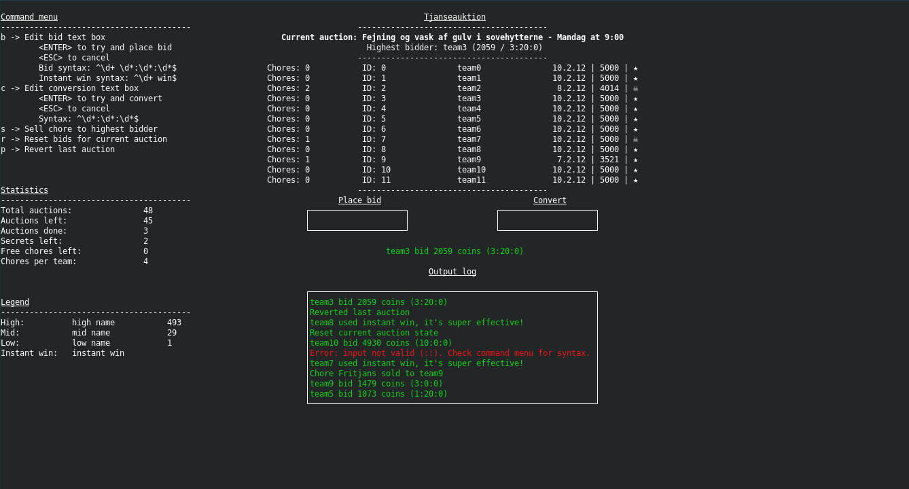

# Tjanseauktion

A pure Python port of the original [Tjanseauktion](https://github.com/MikkelKettunen/Tjanseauktion) used on fyttetur.

## Setup

### Prerequisites

- Python 3.6+

### Installation

```
$ mkdir logs
```

## Usage

To run

```
(venv) $ python tjanseauktion.py
```



Upon launch you are presented with the above GUI.

On the left hand side are three menus:
- **Command menu**: available key-based commands
  - Note that as of now, it is only possible to interact using commands - mouse input is not implemented
- **Statistics**: various statistics pertaining to setup and progress of the auction
- **Legend**: names of the different currencies - these are set in `cfg.ini`

In the center is the tjanseauktion tool. 
At the top is the current auction as well as the highest bidder, followed by a table of all teams and their relevant information.
Once a team has reached their required number of chores (i.e., the `Chores per team` row in the statistics menu), their row will be highlighted.

The output log will retain the last 10 log messages, and all log messages will be saved in `logs/message-log-DATE.txt`.

Upon each action performed the state will be saved to `logs/state-log-DATE.json`.
If this log is present (and valid) it will be loaded on launch.
